<h2 align = "center">
    
</h2>

<h2 align = "center"> 👨‍💻 About me </h2>

<!--
<h2 align = "center"> :mailbox_with_mail: Let's Connect </h2>

-->

<h2 align = "center"> :trophy: Certifications </h2>

<h2 align = "center"> :muscle: Challenges </h2>

<h2 align = "center"> 🛠️ Languages, Frameworks, Libraries and Tools </h2>

<h2 align = "center"> 🌿 My Ecosystem </h2>

<h2 align="center">:star: Top Projects</h2>
<table align="center">
    <tr>
        <td align="center">
            
        </td>
    </tr>
</table>

<h2 align="center">:bar_chart: GitHub Stats</h2>
<table align="center">
    <tr>
        <td colspan="2" align="center">
            
        </td>
    </tr>
    <tr>
        <td align="center">
            
        </td>
        <td align="center">
            
        </td>
    </tr>
    <tr>
        <td colspan="2" align="center">
            <picture>
                <source media="(prefers-color-scheme: dark)" srcset="https://raw.githubusercontent.com/SoyFabianRG/SoyFabianRG/output/github-contribution-grid-snake-dark.svg">
                
            </picture>
        </td>
    </tr>
</table>
